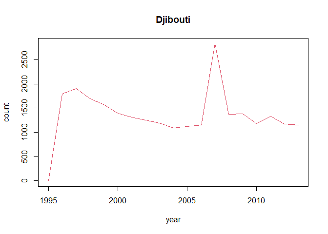
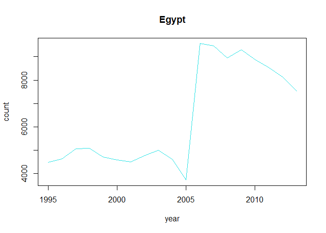
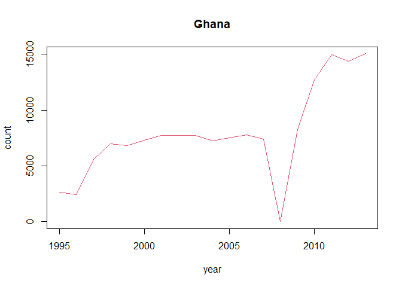
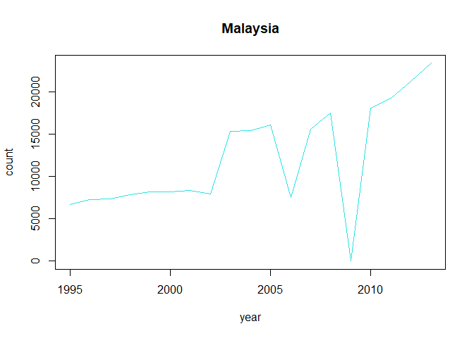
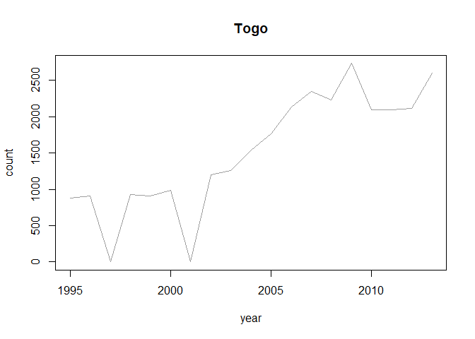

Wczytywanie danych i ładowanie bibliotek
----------------------------------------

``` r
library(EDAWR)
```

    ## 
    ## Attaching package: 'EDAWR'

    ## The following object is masked from 'package:dplyr':
    ## 
    ##     storms

``` r
data_source<-tb
```

Krótkie podsumowanie danych w zbiorze
-------------------------------------

``` r
knitr::kable(summary(data_source))
```

<table style="width:100%;">
<colgroup>
<col style="width: 3%" />
<col style="width: 17%" />
<col style="width: 13%" />
<col style="width: 17%" />
<col style="width: 16%" />
<col style="width: 15%" />
<col style="width: 17%" />
</colgroup>
<thead>
<tr class="header">
<th style="text-align: left;"></th>
<th style="text-align: left;">country</th>
<th style="text-align: left;">year</th>
<th style="text-align: left;">sex</th>
<th style="text-align: left;">child</th>
<th style="text-align: left;">adult</th>
<th style="text-align: left;">elderly</th>
</tr>
</thead>
<tbody>
<tr class="odd">
<td style="text-align: left;"></td>
<td style="text-align: left;">Length:3800</td>
<td style="text-align: left;">Min. :1995</td>
<td style="text-align: left;">Length:3800</td>
<td style="text-align: left;">Min. : 0.0</td>
<td style="text-align: left;">Min. : 0</td>
<td style="text-align: left;">Min. : 0.0</td>
</tr>
<tr class="even">
<td style="text-align: left;"></td>
<td style="text-align: left;">Class :character</td>
<td style="text-align: left;">1st Qu.:1999</td>
<td style="text-align: left;">Class :character</td>
<td style="text-align: left;">1st Qu.: 25.0</td>
<td style="text-align: left;">1st Qu.: 1128</td>
<td style="text-align: left;">1st Qu.: 84.5</td>
</tr>
<tr class="odd">
<td style="text-align: left;"></td>
<td style="text-align: left;">Mode :character</td>
<td style="text-align: left;">Median :2004</td>
<td style="text-align: left;">Mode :character</td>
<td style="text-align: left;">Median : 76.0</td>
<td style="text-align: left;">Median : 2589</td>
<td style="text-align: left;">Median : 230.0</td>
</tr>
<tr class="even">
<td style="text-align: left;"></td>
<td style="text-align: left;">NA</td>
<td style="text-align: left;">Mean :2004</td>
<td style="text-align: left;">NA</td>
<td style="text-align: left;">Mean : 493.2</td>
<td style="text-align: left;">Mean : 10864</td>
<td style="text-align: left;">Mean : 1253.0</td>
</tr>
<tr class="odd">
<td style="text-align: left;"></td>
<td style="text-align: left;">NA</td>
<td style="text-align: left;">3rd Qu.:2009</td>
<td style="text-align: left;">NA</td>
<td style="text-align: left;">3rd Qu.: 264.5</td>
<td style="text-align: left;">3rd Qu.: 6706</td>
<td style="text-align: left;">3rd Qu.: 640.0</td>
</tr>
<tr class="even">
<td style="text-align: left;"></td>
<td style="text-align: left;">NA</td>
<td style="text-align: left;">Max. :2013</td>
<td style="text-align: left;">NA</td>
<td style="text-align: left;">Max. :25661.0</td>
<td style="text-align: left;">Max. :731540</td>
<td style="text-align: left;">Max. :125991.0</td>
</tr>
<tr class="odd">
<td style="text-align: left;"></td>
<td style="text-align: left;">NA</td>
<td style="text-align: left;">NA</td>
<td style="text-align: left;">NA</td>
<td style="text-align: left;">NA’s :396</td>
<td style="text-align: left;">NA’s :413</td>
<td style="text-align: left;">NA’s :413</td>
</tr>
</tbody>
</table>

Liczbę zachorowań z podziałem na płeć
-------------------------------------

``` r
t_date<- group_by(data_source, sex)

summarize(t_date, count=sum(child + adult +     elderly, na.rm=TRUE))
```

    ## # A tibble: 2 x 2
    ##   sex       count
    ##   <chr>     <int>
    ## 1 female 15610599
    ## 2 male   27016456

Wykres liniowy sumarycznej liczby zachorowań wśród dzieci, dorosłych i osób starszych w kolejnych latach
--------------------------------------------------------------------------------------------------------

``` r
t_date<- group_by(data_source, year)

a <- summarize(t_date, count=sum(child + adult + elderly, na.rm=TRUE))
plot(a, ylab="count",type="l",col="red")
```


Wykres liniowy sumarycznej liczby zachorowań wśród dzieci, dorosłych i osób starszych w kolejnych latach z podzialem na kraje
-----------------------------------------------------------------------------------------------------------------------------

``` r
new_data<-data_source %>%
  group_split(country)

for(i in 1:length(new_data)) {
  a <- new_data[[i]]%>% group_by(year) %>%
  summarise(a_sum=sum(child + adult + elderly, na.rm=TRUE)) 
  plot(a, ylab="count",type="l",col=i,main=new_data[[i]][1,"country"])
}
```


