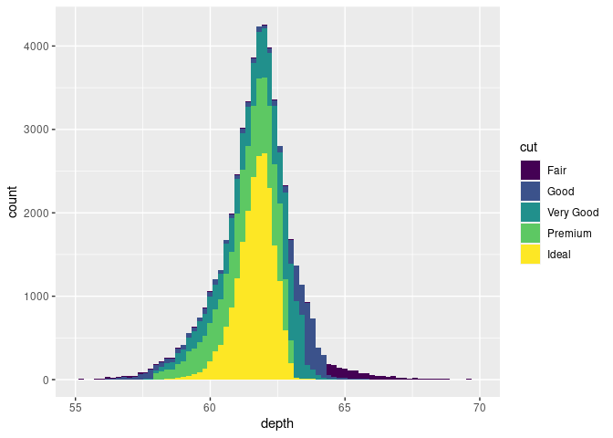
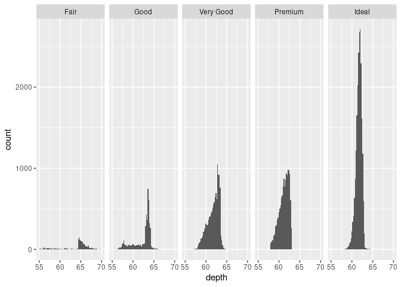
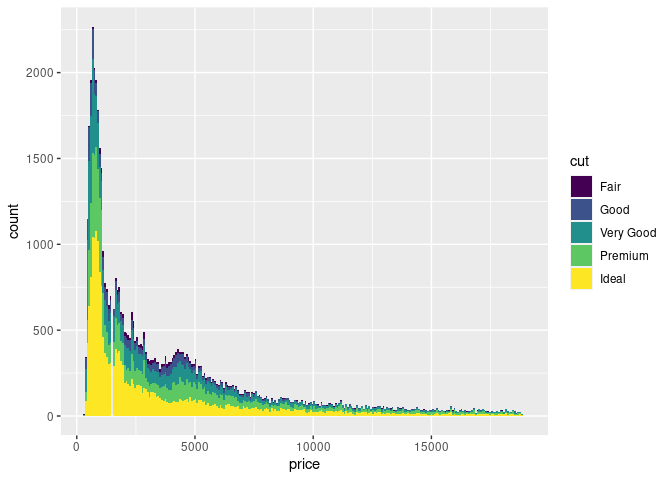
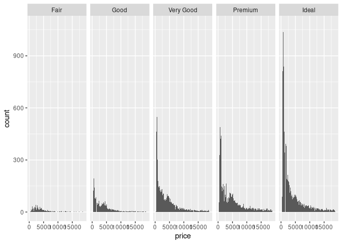
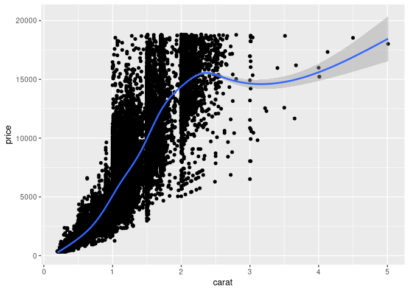

Histogramy zmiennej *depth*
---------------------------

### Kolory

``` r
ggplot(diamonds, aes(x = depth, fill = cut)) +
  geom_histogram(binwidth = 0.2) +
  xlim(55, 70)
```



### Panele

``` r
ggplot(diamonds, aes(x = depth)) +
  geom_histogram(binwidth = 0.2) +
  xlim(55, 70) +
  facet_grid(. ~ cut)
```



Histogramy zmiennej *price*
---------------------------

### Kolory

``` r
ggplot(diamonds, aes(x = price, fill = cut)) +
  geom_histogram(binwidth = 75) +
  xlim(250, 19000)
```



### Panele

``` r
ggplot(diamonds, aes(x = price)) +
  geom_histogram(binwidth = 75) +
  xlim(250, 19000) +
  facet_grid(. ~ cut)
```



Relacja między *carat* i *price*
--------------------------------

``` r
ggplot(diamonds, aes(x = carat, y = price)) +
  geom_point() +
  geom_smooth()
```

    ## `geom_smooth()` using method = 'gam' and formula 'y ~ s(x, bs = "cs")'


