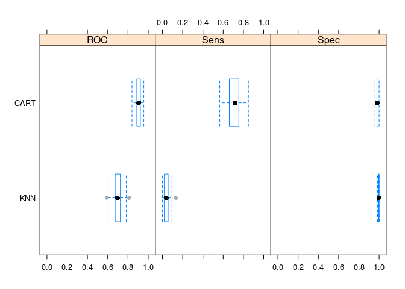
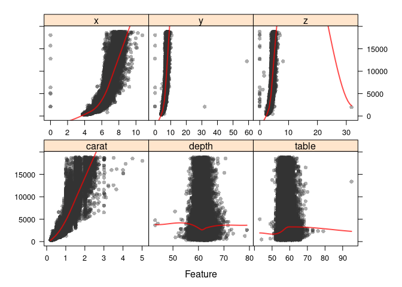

Uczenie maszynowe w R I
=======================

Zad 1 - klasyfikacja
--------------------

### Ładowanie danych

``` r
data(mlc_churn)
churnData <- data.frame(mlc_churn)
```

### Podział zbioru

``` r
set.seed(23)
inTraining <- createDataPartition(
  y = churnData$churn,
  p = 0.75,
  list = FALSE
)

training_set <- churnData[inTraining,]
test_set <- churnData[-inTraining,]
```

### Klasyfikatory

``` r
ctrl <- trainControl(
  method = "repeatedcv",
  number = 10,
  repeats = 10,
  classProbs = TRUE,
  summaryFunction = twoClassSummary
)
```

#### CART

``` r
cartGrid <- expand.grid(cp = seq(from = 0.0001, to = 0.01, length = 30))

cartFit <- train(
  churn ~ .,
  data = training_set,
  method = "rpart",
  trControl = ctrl,
  tuneGrid = cartGrid,
  metric = "ROC"
  # Preprocessing nie jest wymagany
)

cartFit
```

    ## CART 
    ## 
    ## 3751 samples
    ##   19 predictor
    ##    2 classes: 'yes', 'no' 
    ## 
    ## No pre-processing
    ## Resampling: Cross-Validated (10 fold, repeated 10 times) 
    ## Summary of sample sizes: 3376, 3375, 3376, 3376, 3376, 3376, ... 
    ## Resampling results across tuning parameters:
    ## 
    ##   cp            ROC        Sens       Spec     
    ##   0.0001000000  0.9019256  0.7238155  0.9802484
    ##   0.0004413793  0.9027661  0.7238155  0.9803416
    ##   0.0007827586  0.9030506  0.7224948  0.9806832
    ##   0.0011241379  0.9039279  0.7213557  0.9811491
    ##   0.0014655172  0.9040078  0.7211705  0.9814596
    ##   0.0018068966  0.9040078  0.7211705  0.9814596
    ##   0.0021482759  0.9043533  0.7177673  0.9825466
    ##   0.0024896552  0.9043533  0.7177673  0.9825466
    ##   0.0028310345  0.9046589  0.7177673  0.9827640
    ##   0.0031724138  0.9054123  0.7160797  0.9830124
    ##   0.0035137931  0.9054257  0.7160797  0.9831056
    ##   0.0038551724  0.9054257  0.7160797  0.9831056
    ##   0.0041965517  0.9051437  0.7119322  0.9840373
    ##   0.0045379310  0.9051437  0.7119322  0.9840373
    ##   0.0048793103  0.9050352  0.7115549  0.9840994
    ##   0.0052206897  0.9049626  0.7100454  0.9844099
    ##   0.0055620690  0.9039448  0.7062858  0.9851242
    ##   0.0059034483  0.9038959  0.7053424  0.9851242
    ##   0.0062448276  0.9038959  0.7053424  0.9851242
    ##   0.0065862069  0.9035975  0.7038365  0.9852795
    ##   0.0069275862  0.9035975  0.7038365  0.9852795
    ##   0.0072689655  0.9033790  0.7023270  0.9853106
    ##   0.0076103448  0.9029143  0.7015723  0.9841615
    ##   0.0079517241  0.9029565  0.7011950  0.9842236
    ##   0.0082931034  0.9029565  0.7011950  0.9842236
    ##   0.0086344828  0.9021376  0.6981831  0.9828261
    ##   0.0089758621  0.9021376  0.6981831  0.9828261
    ##   0.0093172414  0.9021376  0.6981831  0.9828261
    ##   0.0096586207  0.9017303  0.6974284  0.9817391
    ##   0.0100000000  0.9016638  0.6968623  0.9817702
    ## 
    ## ROC was used to select the optimal model using the largest value.
    ## The final value used for the model was cp = 0.003855172.

``` r
cartPred <- predict(cartFit, newdata = test_set)
confusionMatrix(data = cartPred, test_set$churn)
```

    ## Confusion Matrix and Statistics
    ## 
    ##           Reference
    ## Prediction  yes   no
    ##        yes  119   21
    ##        no    57 1052
    ##                                           
    ##                Accuracy : 0.9376          
    ##                  95% CI : (0.9227, 0.9503)
    ##     No Information Rate : 0.8591          
    ##     P-Value [Acc > NIR] : < 2.2e-16       
    ##                                           
    ##                   Kappa : 0.7179          
    ##                                           
    ##  Mcnemar's Test P-Value : 7.402e-05       
    ##                                           
    ##             Sensitivity : 0.67614         
    ##             Specificity : 0.98043         
    ##          Pos Pred Value : 0.85000         
    ##          Neg Pred Value : 0.94860         
    ##              Prevalence : 0.14091         
    ##          Detection Rate : 0.09528         
    ##    Detection Prevalence : 0.11209         
    ##       Balanced Accuracy : 0.82828         
    ##                                           
    ##        'Positive' Class : yes             
    ## 

#### kNN

``` r
knnGrid <- expand.grid(k = seq(from = 1, to = 13, by = 2))

knnFit <- train(
  churn ~ .,
  data = training_set,
  method = "knn",
  trControl = ctrl,
  tuneGrid = knnGrid,
  preProc = c("center", "scale"),
  metric = "ROC"
)

knnFit
```

    ## k-Nearest Neighbors 
    ## 
    ## 3751 samples
    ##   19 predictor
    ##    2 classes: 'yes', 'no' 
    ## 
    ## Pre-processing: centered (69), scaled (69) 
    ## Resampling: Cross-Validated (10 fold, repeated 10 times) 
    ## Summary of sample sizes: 3375, 3376, 3376, 3376, 3376, 3376, ... 
    ## Resampling results across tuning parameters:
    ## 
    ##   k   ROC        Sens         Spec     
    ##    1  0.5933422  0.256156534  0.9305280
    ##    3  0.6696241  0.143497554  0.9800621
    ##    5  0.6928235  0.077955975  0.9917391
    ##    7  0.6983448  0.040097834  0.9966149
    ##    9  0.6953941  0.024283718  0.9988199
    ##   11  0.6925521  0.012225716  0.9992547
    ##   13  0.6884568  0.005646401  0.9996584
    ## 
    ## ROC was used to select the optimal model using the largest value.
    ## The final value used for the model was k = 7.

``` r
knnPred <- predict(knnFit, newdata = test_set)
confusionMatrix(data = knnPred, test_set$churn)
```

    ## Confusion Matrix and Statistics
    ## 
    ##           Reference
    ## Prediction  yes   no
    ##        yes    6    4
    ##        no   170 1069
    ##                                           
    ##                Accuracy : 0.8607          
    ##                  95% CI : (0.8402, 0.8794)
    ##     No Information Rate : 0.8591          
    ##     P-Value [Acc > NIR] : 0.4553          
    ##                                           
    ##                   Kappa : 0.0501          
    ##                                           
    ##  Mcnemar's Test P-Value : <2e-16          
    ##                                           
    ##             Sensitivity : 0.034091        
    ##             Specificity : 0.996272        
    ##          Pos Pred Value : 0.600000        
    ##          Neg Pred Value : 0.862793        
    ##              Prevalence : 0.140913        
    ##          Detection Rate : 0.004804        
    ##    Detection Prevalence : 0.008006        
    ##       Balanced Accuracy : 0.515182        
    ##                                           
    ##        'Positive' Class : yes             
    ## 

### Porównanie

``` r
resamps <- resamples(list(CART = cartFit,
                          KNN = knnFit))
```

``` r
theme1 <- trellis.par.get()
theme1$plot.symbol$col = rgb(.2, .2, .2, .4)
theme1$plot.symbol$pch = 16
theme1$plot.line$col = rgb(1, 0, 0, .7)
theme1$plot.line$lwd <- 2
trellis.par.set(theme1)
bwplot(resamps, layout = c(3, 1))
```



Zad 2 - regresja
----------------

### Podział zbioru

``` r
data(diamonds)
df_diamonds <- data.frame(diamonds)

inTraining2 <- createDataPartition(
  y = df_diamonds$price,
  p = 0.7,
  list = FALSE
)
training_set2 <- df_diamonds[inTraining2,]
test_set2 <- df_diamonds[-inTraining2,]
```

### Wpływ zmiennych na cenę diamentu

``` r
theme1 <- trellis.par.get()
theme1$plot.symbol$col = rgb(.2, .2, .2, .4)
theme1$plot.symbol$pch = 16
theme1$plot.line$col = rgb(1, 0, 0, .7)
theme1$plot.line$lwd <- 2
trellis.par.set(theme1)

featurePlot(x = df_diamonds[, c("carat", "depth", "table", "x", "y", "z")],
            y = df_diamonds$price,
            plot = "scatter",
            layout = c(3, 2),
            type = c("p", "smooth"),
            span = .5)
```



### Regresor

``` r
glmnetCtrl <- trainControl(
  method = "repeatedcv",
  number = 10,
  repeats = 10
)

glmnetFit <- train(
  price ~ .,
  data = training_set2,
  method = "glmnet",
  trControl = glmnetCtrl,
  preProcess = c("center", "scale")
)

glmnetFit
```

    ## glmnet 
    ## 
    ## 37759 samples
    ##     9 predictor
    ## 
    ## Pre-processing: centered (23), scaled (23) 
    ## Resampling: Cross-Validated (10 fold, repeated 10 times) 
    ## Summary of sample sizes: 33983, 33983, 33985, 33984, 33982, 33983, ... 
    ## Resampling results across tuning parameters:
    ## 
    ##   alpha  lambda      RMSE      Rsquared   MAE      
    ##   0.10     7.331607  1133.379  0.9189252   748.3490
    ##   0.10    73.316067  1176.965  0.9130150   807.8232
    ##   0.10   733.160670  1454.423  0.8729132   997.9205
    ##   0.55     7.331607  1134.159  0.9188168   749.2572
    ##   0.55    73.316067  1186.160  0.9118685   789.2220
    ##   0.55   733.160670  1646.540  0.8479108  1041.4960
    ##   1.00     7.331607  1135.570  0.9186157   750.3809
    ##   1.00    73.316067  1204.503  0.9092026   791.5454
    ##   1.00   733.160670  1711.517  0.8489686  1065.2755
    ## 
    ## RMSE was used to select the optimal model using the smallest value.
    ## The final values used for the model were alpha = 0.1 and lambda = 7.331607.

``` r
glmnetPred <- predict(glmnetFit, newdata = test_set2)
postResample(pred = glmnetPred, obs = test_set2$price)
```

    ##         RMSE     Rsquared          MAE 
    ## 1128.8984885    0.9209418  746.1007980
