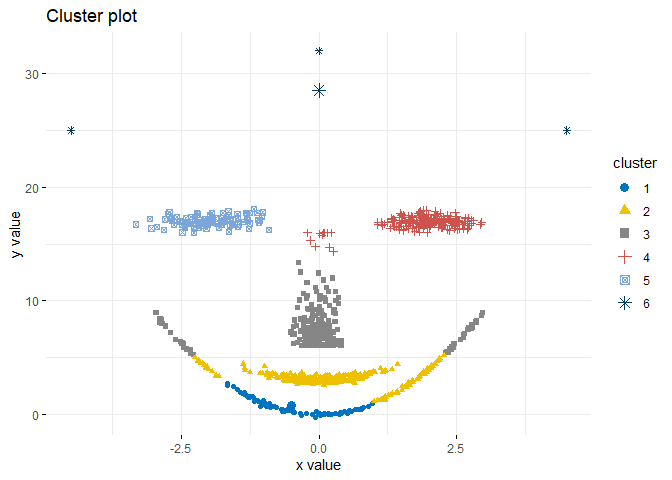

Wczytywanie danych i ładowanie bibliotek
----------------------------------------

``` r
ggplot(df, aes(x, y, color=factor(labels))) + 
    geom_point() + 
    theme_bw()
```


Algorytm k-średnich
-------------------

``` r
km.res <- eclust(df, "kmeans", k = 6, nstart = 25, graph = F)
fviz_cluster(km.res, df, stand=F, ellipse=F, show.clust.cent=T, geom="point", palette = "jco", ggtheme = theme_minimal())
```


``` r
table(labels, km.res$cluster)
```

    ##       
    ## labels   1   2   3   4   5   6
    ##      1  93  60   0  46   0   0
    ##      2   0   0   0   0 100   0
    ##      3   0 299   0   0   0   0
    ##      4   0   0   0 184  14   1
    ##      5   0   0   0   0   0 199
    ##      6   0   0   4   0   0   0

``` r
clust_stats <- cluster.stats(d = dist(df), labels, km.res$cluster)
clust_stats$corrected.rand
```

    ## [1] 0.7549897

Algorytm k-medoidów
-------------------

``` r
pam.res <- eclust(df, "pam", k = 6, graph = F)
fviz_cluster(pam.res, df, stand=F, ellipse=F, show.clust.cent=T, geom="point", palette = "jco", ggtheme = theme_minimal())
```


``` r
table(labels, pam.res$cluster)
```

    ##       
    ## labels   1   2   3   4   5   6
    ##      1  88  61  12  38   0   0
    ##      2   0   0   0   0   0 100
    ##      3   0 299   0   0   0   0
    ##      4   0   0  70 117   7   5
    ##      5   0   0   0   0 199   0
    ##      6   0   0   0   0   3   1

``` r
clust_stats <- cluster.stats(d = dist(df), labels, pam.res$cluster)
clust_stats$corrected.rand
```

    ## [1] 0.708845

Algorytm AHC
------------

``` r
hc.res <- eclust(df, "hclust", k = 6, hc_metric = "euclidean", hc_method = "ward.D2", graph = F)
fviz_cluster(hc.res, df, stand=F, ellipse=F, show.clust.cent=T, geom="point", palette = "jco", ggtheme = theme_minimal())
```



``` r
table(labels, hc.res$cluster)
```

    ##       
    ## labels   1   2   3   4   5   6
    ##      1  84  68  47   0   0   0
    ##      2   0   0   0   0 100   0
    ##      3   0 299   0   0   0   0
    ##      4   0   0 188  11   0   0
    ##      5   0   0   0 199   0   0
    ##      6   0   0   0   0   0   4

``` r
clust_stats <- cluster.stats(d = dist(df), labels, hc.res$cluster)
clust_stats$corrected.rand
```

    ## [1] 0.7418435

Algorytm DBSCAN
---------------

``` r
db.res <- fpc::dbscan(df, eps=1, MinPts=30)
fviz_cluster(db.res, df, stand=F, ellipse=F, show.clust.cent=T, geom="point", palette="jco", ggtheme= theme_classic())
```


``` r
table(labels, db.res$cluster)
```

    ##       
    ## labels   0   1   2   3   4   5
    ##      1  53  94  52   0   0   0
    ##      2   0   0   0   0   0 100
    ##      3   0   0 299   0   0   0
    ##      4  28   0   0 171   0   0
    ##      5   0   0   0   0 199   0
    ##      6   4   0   0   0   0   0

``` r
clust_stats <- cluster.stats(d = dist(df), labels, db.res$cluster)
```

    ## Warning in cluster.stats(d = dist(df), labels, db.res$cluster): alt.clustering
    ## renumbered because maximum != number of clusters

``` r
clust_stats$corrected.rand
```

    ## [1] 0.795417
